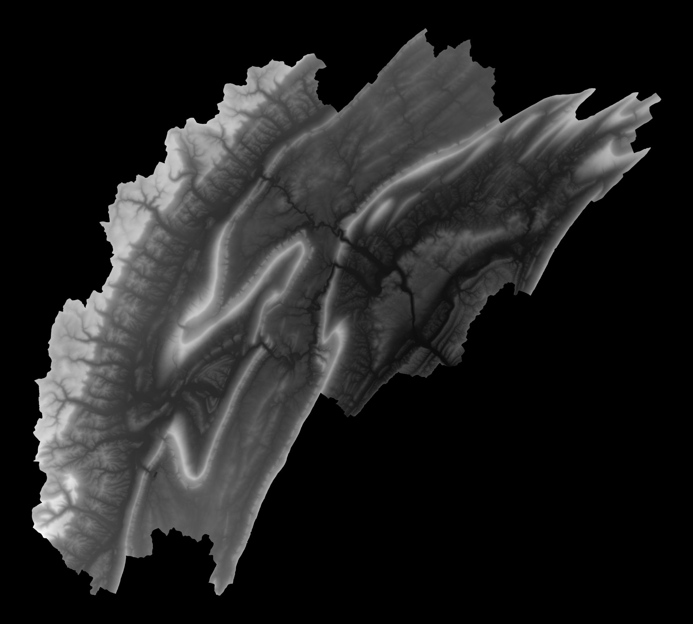
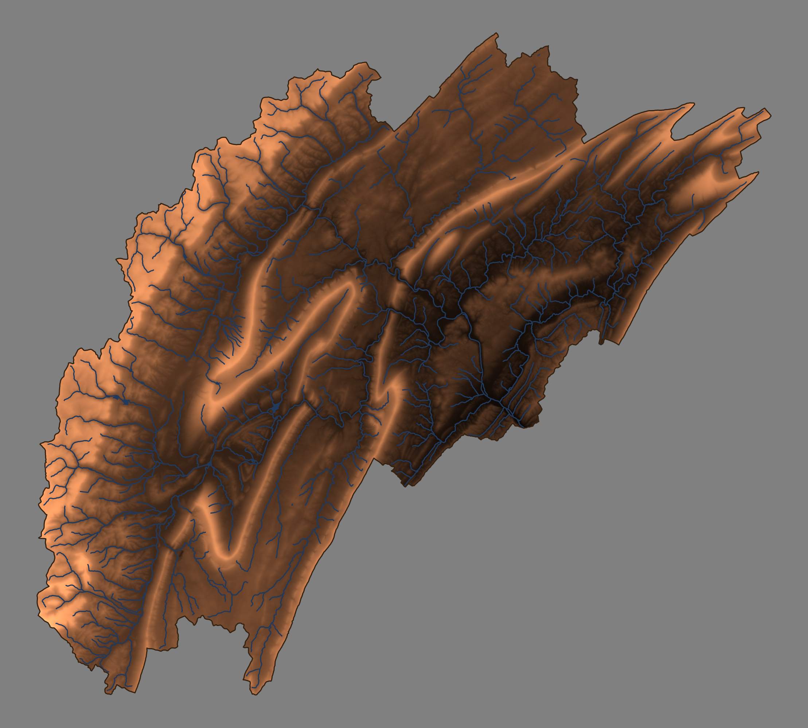
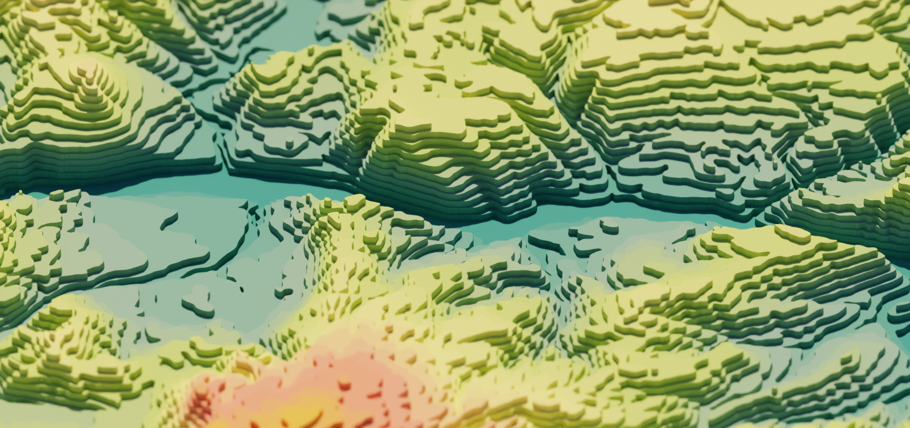
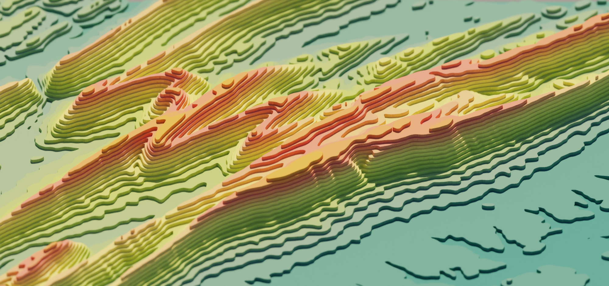
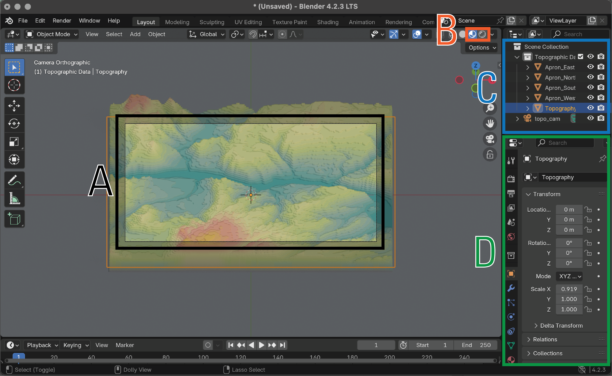

# TopoRivBlender 

*A data pipeline for fetching, processing, and visualizing topographic and hydrographic data*

**Authors**: Jeffrey Kwang, Anthony Martinez, Wallace (Andy) Mcaliley, and Cee Nell

**Point of contact**: Jeffrey Kwang ([jkwang\@usgs.gov](mailto:jkwang@usgs.gov))

**Repository Type**: `python` script

**Year of Origin**: 2025 (original publication)

**Year of Version**: 2025

**Digital Object Identifier (DOI)**: <#####>

**USGS Information Product Data System (IPDS) no.**: IP-##### (internal agency tracking)

------------------------------------------------------------------------

## Introduction

TopoRivBlender is a `python` pipeline for creating of 3D visualization of topography and hydrography with realistic lighting (see below). It aims to streamline two common bottlenecks:

1. The retrieval and processing of [topographic](https://www.usgs.gov/faqs/what-a-digital-elevation-model-dem) and [hydrographic](https://www.usgs.gov/faqs/what-national-hydrography-dataset-nhd#:~:text=The%20National%20Hydrography%20Dataset%20(NHD)%20is%20a%20digital%20vector%20dataset,%2C%20streams%2C%20rivers%2C%20canals%2C) information
2. Creation of the 3D render in [Blender](https://www.blender.org/download/), an free, open source 3D visualization program.

After installing the requirements, you should be able to make custom rendered images with a single command in a couple of minutes. This repository is meant to be a starting place; my hope is that you take this pipeline and use it for your own projects without much fuss.

<a name="fig1"></a>
<div align="center">
    
    <p> <b>Figure 1</b>: <em>Example render of Upper Juniata in Central Pennsylvania using USGS 3DEP 10m (HUC: 02050302).</em></p>
</div>

### Setup:

#### Install dependencies

##### For MacOS and Linux

1. Install [homebrew](https://brew.sh/)
2. Install [Miniforge](https://github.com/conda-forge/miniforge), with `brew install --cask miniforge`
3. Install [Blender](https://www.blender.org/download/)
4. Check that you can access both `conda` and `Blender` by typing them in the terminal.

##### For Windows
1. Install [Git Bash](https://git-scm.com/downloads)
2. Install [Miniforge](https://github.com/conda-forge/miniforge)
    - Open the `Miniforge Prompt`
    - Execute `conda init bash`
    - After running the command, you should see that the code modified the `~/.bash_profile`. This will allow you to use the `conda` command in Git Bash.
3. Install [Blender](https://www.blender.org/download/)
    - NOTE: Be sure to note where Blender is installed.
    - At this time, 4.4 is the latest version and it installed in `C:\Program Files\Blender Foundation\Blender 4.4`.
4. Add Blender command to `PATH` by editing the `~/.bashrc`
    - Open Git Bash
    - Edit the file with `nano ~/.bashrc`
    - Paste `export PATH=$PATH:"/c/Program Files/Blender Foundation/Blender 4.4"`. NOTE: Adjust the directory based on where Blender installed on your machine. Also make sure to adjust the version number accordingly.
5. Check that you can access both `conda` and `Blender` by typing them in Git Bash.

#### Download TopoRivBlender

1. Fork, clone, or download a zipped version of this repository.
2. Create a directory, `path/to/topo-riv-blender`, and place the contents of this repository in the directory.

#### Get an API key from OpenTopography

1. Request an API Key from [Open Topography](https://opentopography.org/blog/introducing-api-keys-access-opentopography-global-datasets)
2. Create a .txt file named opentopography_api_key.txt in `path/to/topo-riv-blender` and paste your api key in it.

#### Set up the conda environment

1. In the terminal (or Miniforge Prompt in Windows) change directories to the project directory with `cd path/to/topo-riv-blender`
2. Create the `conda` environment with the `environment.yaml` file.
    Run `conda env create -f environment.yaml`
3. Activate the conda environment.
    Run `conda activate topo-riv-blender`

## How does it work?

To make a rendered image, this code requires a single command: `snakemake --cores 1` (while inside the `topo-riv-blender` directory). This command will build a `snakemake` pipeline ([documents](https://snakemake.readthedocs.io/en/stable/)) that will run all the modules required to retrieve the data, process the data, and render the data using a single core (`--cores 1`). When running the `snakemake --cores 1` command, `snakemake` assumes there will be a file named `Snakefile`. This file contains an example pipeline workflow that generates rendered images of 3DEP 10m USGS digital elevation models and NHD lines for a user-defined Hydrologic Unit Code ([HUC](https://water.usgs.gov/GIS/huc.html)). Use this [link](https://www.usgs.gov/faqs/how-can-i-find-huc-hydrologic-unit-code-stream-how-can-i-find-namelocation-stream-using-huc) to find a HUC you'd like to explore. Below, we will detail what the pipeline actually does.

**Note**: `snakemake` is great at parallelizing code, i.e., using `snakemake --cores all`; however, using multiple cores to render multiple topographies is not generally recommended. Rendering is quite GPU/CPU intensive.

#### `snakemake`

1. `snakemake` looks for the parameters file, `blender_parameters/blender_params_auto.py`. This file contains information on the type of data source to use for the digital elevation models, the colors of the objects in the render, and the camera/render settings in Blender. These defaults are a good starting place, but you may want to adjust things later.
2. In the `Snakefile`, we specify many **rules**, which are steps in the code. For each rule, a subcommand is executed to take specified input files and make output files.
3. The first rule, `rule all`, is a special rule. This is the final expected output that we want the `snakemake` pipeline to make. In the `Snakefile`, the final outputs are the rendered images `phase_2_visualize/out/render_140100.png`, `phase_2_visualize/out/render_02050302.png`, and `phase_2_visualize/out/render_070400030309.png`. When you run `snakemake --cores 1`, `snakemake` will recognize that these images do not exist and will then work backwards to find all the inputs necessary to make them. If those inputs don't exist, it keeps working backwards until it has everything it needs.

In the example below, we will explain the workflow for making <a href="#fig1">Figure 1</a> (HUC8: 02050302, the Upper Juniata in Central Pennsylvania). This workflow is executed by running: `snakemake --cores 1 phase_2_visualize/out/render_02050302.png`. On my MacBook Pro (M2 Max chip) the pipeline took ~2 minutes to run. Depending on your specific hardware a single fetch, process, and render step should not take longer than 5 minutes. For other HUCs, you can specify snakemake to make a rendered image of a HUC like this, but alternatively, you can change the list of outputs in `rule all` in the `Snakefile`. **Note**: For clarity, some of the additional parameters and files are omitted from the description below.

<div align="center">
    
    <p> <b>Figure 2</b>: <em> The Directed Acyclic Graph of the TopoRivBlender workflow for generating the render of HUC: 02050302.</em></p>
</div>
   
#### Phase 1: Fetching

##### rule get_wdb:
- *Description*: Downloads a shapefile of the HUC boundary
- *Parameters*: HUC8 - `02050302`
- *Output*: `phase_0_fetch/out/02050302/extent.shp`

##### rule get_nhd1:
- *Description*: Downloads [NHD](https://www.usgs.gov/national-hydrography/national-hydrography-dataset) flowline data within the extent 
- *Input*: `phase_0_fetch/out/02050302/extent.shp`
- *Output*: `phase_0_fetch/out/02050302/rivers.shp`

##### rule get_nhd2:
- *Description*: Downloads [NHD](https://www.usgs.gov/national-hydrography/national-hydrography-dataset) waterbody data within the extent 
- *Input*: `phase_0_fetch/out/02050302/extent.shp`
- *Output*: `phase_0_fetch/out/02050302/waterbody.shp`

##### rule download_dem:
- *Description*: Downloads a digital elevation model within the extent 
- *Parameters*: Data Type - `USGS 10m 3DEP`
- *Input*: `phase_0_fetch/out/02050302/extent.shp`
- *Output*: `phase_0_fetch/out/02050302/dem.tif`

#### Phase 2: Processing

##### rule create_heightmap_texturemap:
- *Description*: Creates a grayscale height map and texture map for Blender to render. The height map is used to determine how high the landscape should be in the render, and the texture map determines the color of the landscape.
- *Parameters*: `blender_parameters/blender_params_auto.py`
- *Input**: [`phase_0_fetch/out/02050302/extent.shp`, `phase_0_fetch/out/02050302/rivers.shp`, `phase_0_fetch/out/02050302/waterbody.shp`, `phase_0_fetch/out/02050302/dem.tif`]
- *Output*: [`phase_1_process/out/02050302/heightmap.tif`, `phase_1_process/out/02050302/texturemap.tif`]

<div align="center">
    
    <p> <b>Figure 3</b>: <em>Example height map of Upper Juniata in Central Pennsylvania using USGS 3DEP 10m (HUC: 02050302). Dark shades are low elevation, and lighter shades are higher elevation.</em></p>
</div>

<div align="center">
    
    <p> <b>Figure 4</b>: <em>Example texture map of Upper Juniata in Central Pennsylvania using USGS 3DEP 10m (HUC: 02050302).</em></p>
</div>

#### Phase 3: Visualizing

##### rule render:
- *Description*: Using the height map and texture map, Blender sets up the scene (topography, lighting, and camera) and renders a photorealistic image.
- *Parameters*: `blender_parameters/blender_params_auto.py`
- *Input*: [`phase_1_process/out/02050302/heightmap.tif`, `phase_1_process/out/02050302/texturemap.tif`]
- *Output*: `phase_2_visualize/out/render_02050302.png`

<div align="center">
    
    <p> <b>Figure 5</b> (same as <a href="#fig1">Figure 1</a>): <em>Example render of Upper Juniata in Central Pennsylvania using USGS 3DEP 10m (HUC: 02050302)</em></p>
</div>

## The parameters file

A parameters file is saved in the `blender_parameters` folder and contains many of the options that determine the look of your final render. Below is a breakdown of the variety of parameters available and their definitions, organized by category.

#### Data Management
- `dem_product`: The specific DEM product to be downloaded from Open Topography's [API](https://opentopography.org/blog/introducing-api-keys-access-opentopography-global-datasets). Use `auto` to have the code automatically determine the coarsest DEM that will still maintain good image fidelity.
- `nhd_flowline`: The flowline (rivers) resolution `flowline_mr` (medium resolution) or `flowline_hr` (high resolution). Use `flowline_auto` to have the code automatically determine which resolution to use. It will try to balance between too much and too little detail.
- `nhd_waterbody`: The waterbody (lakes, reservoirs, ponds, etc.) resolution `waterbody_mr` (medium resolution) or `waterbody_hr` (high resolution).  Use `waterbody_auto` to have the code automatically determine which resolution to use.
- `buffer`: A percentage that makes a buffer around the area of interest based on the percentage of height and width of the bounding box. This downloads extra data to ensure no missing data occurs near the edges of the download area. Default is 1%.

#### Map Visualization
- `background_color`: The rgba color of the surrounding background of the render.
- `wall_color`: If you can see the edge of the topography, this will be the wall color.
- `river_color`: The rgba color of the rivers and water bodies.
- `topo_cmap`: The [matplotlib colormap](https://matplotlib.org/stable/gallery/color/colormap_reference.html) used to color the topography.
- `topo_cstops`: You can specify a custom colormap for topography by setting a number of colors in sequence. By default, these colors are assumed to be evenly spaced and linearly interpolated in between the stops. For example, if you specified a list, \[[0,0,0,0], [255,255,255]], you would get a black to white gray color ramp. See example in `blender_parameters/blender_params/contour.py`
- `topo_nstops`:  If you want to specify the 8-bit locations of the color stops, you can with this list. See example in `blender_parameters/blender_params/global.py`.

#### Render hardware
- `GPU_boolean`: Set to `True` if you have a powerful GPU to run the render engine. CPU rendering works fine, but GPU rendering could be faster.

#### Blender scene
- `plane_size`: This is length of the major axis of the topographic plane in meters. We are making this landscape miniature (1-meter long) to ensure the topography and camera placement are consistent.
- `number_of_layers`: Number of additional data layers. `0` for just topography. See more info in `additional_parameters.md`.

#### Camera settings
- `view_transform`: Determines how color is [managed](https://docs.blender.org/manual/en/latest/render/color_management.html) in the render. Use `Filmic` For more realistic colors, and `Standard` for less dynamic range.
- `exposure`: Camera exposure setting to change brightness of image; applies a multiple to the pixel values.
- `gamma`: Gamma correction for image to change brightness of image; applies an exponent to the pixel values.
- `camera_type`: `orthogonal` or `perspective`. `perspective` gives a more realistic viewpoint, and `orthgonal` gives more of a miniature effect. I like `orthogonal` most times.
- `ortho_scale` (when `camera_type = orthogonal` only): Orthogonal scale. Increase this value to zoom out.
- `focal_length` (when `camera_type = perspective` only): Focal length of the lens in millimeters, increase this value to zoom in.
- `camera_distance`: Distance the camera is from the topography's center in meters.
- `camera_tilt`: Degrees the camera is tilted from horizontal. 0 degrees is a profile view, and 90 degrees is a planform view.
- `camera_rotation`: Degrees the camera is rotated clockwise around the topography. 0 degrees is North facing, 90 degrees is East facing, 180 degrees is South facing, and 270 degrees is West facing.
- `shift_x`: Distance in meters to shift the camera in the horizontal direction.
- `shift_y`: Distance in meters to shift the camera in the vertical direction.
- `use_depth_of_field`: Allows for a depth of field effect when parts outside of the focal plane are out of focus.
- `dof_distance`: Distance between the camera and the focal plane in meters.
- `f_stop`: Size of aperture of camera. Lower it to have a shallow depth of field; i.e. only a thin area is in focus. Raise it to have a wider depth of field to make more in focus.

#### Sun settings
- `sun_tilt`: Degrees that the sun is from horizontal. Also called the altitude angle. Default is 45 degrees, camera is tilted downward 45 degrees.
- `sun_rotation`: Degrees that the sun rotated clockwise from North. Also called the azimuth angle. Default is 180 degrees, camera facing North.
- `sun_strength`: Sun strength in Watts per square meter. Default is 1.0. If adjustment is needed, I'd recommend changing it within the Blender GUI. The final image is quite sensitive to this value.
- `sun_intensity`: Blender says this is a multiplier for sun disc lighting [[Documentation](https://docs.blender.org/manual/en/4.2/render/shader_nodes/textures/sky.html)]. I'm not sure what this means, but higher means brighter. Default is 0.5. Like `sun_strength`, I'd recommend changing it within the Blender GUI. 

#### Landscape representation
- `min_res`: The minimum resolution of the minor axis of the height and texture map. This partial sets the detail of the height map and texture map. `2000` is a good starting point. Increasing this will give finer detail but is more computationally expensive to run.
- `number_of_subdivisions`: The number of subdivisions on the plane to represent the topography. This essentially determines the number of polygon faces. This should also be set around `2000` but feel free to increase this to get finer detail.
- `exaggeration`: The vertical exaggeration factor. Play around this number for more dramatic or muted topography. `auto` will have the code set it automatically if you don't know what to choose. Look in the `blender` output to see what value the code used.
- `displacement_method`: How the topography is drawn in blender. Default is `DISPLACEMENT`, but you can use `BOTH` to have more exaggerated, but somewhat fake, shadows.

#### Render settings
- `res_x`: Horizontal resolution of the rendered image. ~`2000` is a nice start, but increase this if you want more detail, but be prepared to wait!
- `res_y`: Vertical resolution of the rendered image.
- `samples`: Number of samples blender uses to get a representation of the lighting and shadows. `10` works well, but increase this for better light representation. Lower it to get faster renders but less accurate lighting.

## Frequently Asked Questions (that I made up)

#### How do I render a different HUC, say HUC8: 14010001?
- Like this: `snakemake --cores 1 phase_2_visualize/out/render_14010001.png` or you can change the filenames in `rule all`.

<div align="center">
    
    <p> <b>Figure 6</b>: <em>Example render of HUC: 14010001.</em></p>
</div>

#### How do I render multiple HUCs renders, say HUC8: 14010002 and 14010003?
- Like this: `snakemake --cores 1 phase_2_visualize/out/render_14010002.png phase_2_visualize/out/render_14010003.png` or you can change the filenames in `rule all`.

<div align="center">
    
    <p> <b>Figure 7</b>: <em>Example render of HUC: 14010002.</em></p>
</div>

<div align="center">
    
    <p> <b>Figure 8</b>: <em>Example render of HUC: 14010003.</em></p>
</div>

#### How do I render multiple HUCs together in one render, say HUC8: 14010001, 14010002, and 14010003?
- Like this: `snakemake --cores 1 phase_2_visualize/out/render_14010001and14010002and14010003.png` or you can change the filenames in `rule all`.
  
<div align="center">
    
    <p> <b>Figure 9</b>: <em>Example combined render of HUCs: 14010001, 14010002, and 14010003.</em></p>
</div>

#### Can I download topographic data outside of the United States?
- Yes! [Open Topography](https://opentopography.org/) can retrieve topographic data from many different sources. You can see the list from their [API](https://portal.opentopography.org/apidocs/). Access to USGS 3DEP 10m and 30m is readily accessible by the general public; however, access to the USGS 3DEP 1m data requires a paid plan or a .edu email address. An example snakefile, `Snakefile_global`, contains a workflow for using Copernicus 90 Global DEM. There are also datasets that include combined topography and bathymetry.

 #### What resolution should I use?
 - You should minimize the use of large, high-resolution datasets if you do not need it. For large regions, you will likely see diminishing returns for higher-resolution topography. With high-resolution topography, there may be multiple topographic data points hidden within a single rendered pixel, which the viewer would be unable to see, even when zoomed in fully. 
  
#### Do I need to specify a HUC?
- No, you do not. I have also created a workflow example where you can download topography based on a bounding box. For this workflow, you specify the longitude/latitude pair for the upper-left and lower-right corners of the bounding box. The workflow can be found here: `snakemake --cores 1 -s Snakefile_contour`. Note, here the `-s` flag allows you to specify a different `snakemake` workflow contained the snakefile, `Snakefile_contour`.

#### How can I use satellite imagery in the renders.
- There is an example workflow (`snakemake --cores 1 -s Snakefile_aerial`) that pulls MODIS data using a STAC API. Using the same STAC API, you also have access to Landsat, Sentinel, and other data products. See more in this [Planetary Computer Data Catalog](https://planetarycomputer.microsoft.com/catalog).

<div align="center">
    
    <p> <b>Figure 10</b>: <em>Example custom render of Kings Peak in Northeast Utah with MODIS satellite imagery.</em></p>
</div>

#### How much can I customize my renders with this pipeline?
- While I encourage you to fork your own version of this code to start playing with Blender, you can still make some neat renders with the pipeline in its current state. This is the output of `snakemake --cores 1 -s Snakefile_contour`:
  
<a name="fig11"></a>
<div align="center">
    
    <p> <b>Figure 11</b>: <em>Example custom render of the Columbia River.</em></p>
</div>

- This is the output of `snakemake --cores 1 -s Snakefile_global`:

<div align="center">
    
    <p> <b>Figure 12</b>: <em>Example custom render of Mt. Fuji in Japan with Landsat satellite imagery. This is an example of how to label your renders.</em></p>
</div>


#### Can I add more than one layer/surface?
- Topography is one just one surface, but what if there is another layer/surface that you would like to render (e.g., ice, water)? Below is an example where, we add a flat surface to represent the water surface on Lake Baikal located in Siberia, Russia.
- OpenTopgraphy gives you access to the global dataset, Global Bathymetry SRTM15+ V2.1 500m, which contains bathymetry.
- You can create this render with `snakemake --cores 1 -s Snakefile_lake`.

<div align="center">
    
    <p> <b>Figure 13</b>: <em>Example custom render of Lake Baikal.</em></p>
</div>

#### How do I change the location with the `Snakefile_aerial`, `Snakefile_contour`, `Snakefile_global`, or `Snakefile_lake` pipeline?
- If you like these example workflows but want a different location, you can easily adjust them! Inside these Snakefiles (e.g., `Snakefile_contour`), you will see:

```python
UL_corner = (45.85, -121.65),
LR_corner = (45.50, -121.19),
```

- These are the upper left corner (`UL_corner`) and lower right corner (`LR_corner`) coordinates (latitude, lontitude in decimal degrees). A simple way to find the location is to use [Google Maps](https://www.google.com/maps).
- Simply right-click a point, copy the coordinates in the context menu, and paste them between the brackets. Rerun the `snakemake` command, and the workflow will make an image for your new location. 

```python
UL_corner = (40.33, -77.75),
LR_corner = (40.11, -77.43),
```

You’ll get this image of Tuscarora State Forest!

<div align="center">
    
    <p> <b>Figure 14</b>: <em>Example custom render of the Tuscarora State Forest.</em></p>
</div>

#### How do I iterate and improve my renders efficiently?
- Let's say you used the pipeline to fetch all the data and processed the height and texture map. You rendered the data in Blender, but you don't like the way the topography looks. Maybe you want to have the lighting from a different angle. You could change the settings and then re-render the scene, but that could take a few minutes to re-render. A faster way to tweak these sorts of settings is to use the Blender GUI. By default, the `Snakefile` uses Blender with the background flag `-b`, which uses Blender without the GUI. Remove the the `-b` flag, and your shell command in the `Snakefile` should look like this:
```python
    "Blender -P phase_2_visualize/src/render.py -- "
    "{input.blender_params} "
    "{input.dimensions_file} {input.heightmap_file} {input.texturemap_file} {input.apronmap_file} NULL "
    "{output.output_file} "
```
- Below, we will show you how to modify the final render in the `Snakefile_contour` workflow. After running `snakemake --cores 1 -s Snakefile_contour`, a Blender window will automatically open. You will greeted with the following window:

<div align="center">
    
    <p> <b>Figure 15</b>: <em>The Blender GUI. (A) The 3D viewport of the camera. (B) Use these options to view a non-rendered view (left) or a rendered view (right). (C) The scene collection containing the different objects and the camera. (D) The properties of the scene. Screenshot shows the properties for the location, rotation, and scale of the topography.</em></p>
</div>

- In the Blender properties (D), you can adjust the location, rotation, and scale of the topography, adjust the camera settings and orientation, modify the lighting of the scene, and more. Use the `Material Preview` mode (B) when adjusting the geometric properties. The changes that you make will instantly show in the 3D viewport (A). 

<div align="center">
    
    <p> <b>Figure 16</b>: <em>Adjusting the scale of the topography with the Blender GUI.</em></p>
</div>

- The GIF above does not look nearly as pretty as the final rendered image <a href="#fig11">Figure 11</a>. That's because the scene has not been rendered. To see a preview of what the render may look like, select the `Rendered` mode (B). Adjusting the lighting with the Blender GUI requires you to wait a few seconds for to re-render the scene. The image becomes fuzzy because there a too few samples to render the whole image. Over time, with more samples, the render becomes clearer.

<div align="center">
    
    <p> <b>Figure 17</b>: <em>Adjusting the lighting with the Blender GUI.</em></p>
</div>

- Make sure to take note of the adjustments that you made and record them in the parameters `.py` files in the `blender_parameters` folder. Replace the `-b` in the `Snakefile` and use the pipeline to re-render the scene to get you updated image. You can either delete the rendered image to get the pipeline to re-render or force it to create it. For the contoured image of the Columbia River, you would need to run the following command: `snakemake --cores 1 -s Snakefile_contour phase_2_visualize/out/render_columbiariver.png --force`.

## Main libraries used in this pipeline
A more extensive list can be found in `environment.yaml`, but I would like to highlight the following:
- `gdal` - used to manage, merge, and project raster topographic data
- `geopandas` - used to manage, project, and plot shapefile data
- `pynhd` - used to download nhd flowline and waterbody data
- `pygeohydro` - used to download HUC water boundaries
- `bmi-topography` - used to download DEMs from [OpenTopography's API](https://opentopography.org/)

## Contain Information

If you have questions about this software, please contact Jeffrey Kwang at <jkwang@usgs.gov>.

## Disclaimer
This software is preliminary or provisional and is subject to revision. It is being provided to meet the need for timely best science. The software has not received final approval by the U.S. Geological Survey (USGS). No warranty, expressed or implied, is made by the USGS or the U.S. Government as to the functionality of the software and related material nor shall the fact of release constitute any such warranty. The software is provided on the condition that neither the USGS nor the U.S. Government shall be held liable for any damages resulting from the authorized or unauthorized use of the software.